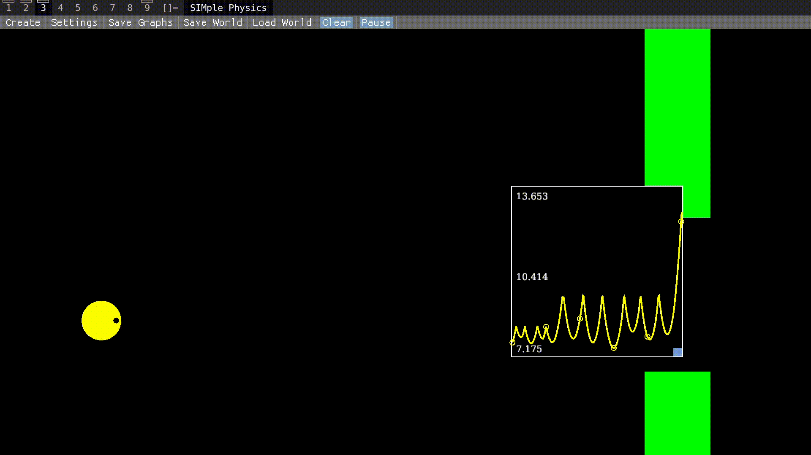

# SIMple Mechanics

Educational physics sim that uses graphs, FBDs, and other helpful stuff to teach physics. 

SIMple Mechanics is part of my SIMple Physics project. Find more info at the website: [https://mkhan45.github.io/SIMple-Physics/tabs/about](https://mkhan45.github.io/SIMple-Physics/tabs/about/)

You can also find sample labs and tutorials at [https://mkhan45.github.io/SIMple-Physics/tags/mechanics/](https://mkhan45.github.io/SIMple-Physics/tags/mechanics/)

## Features

- [X] Basic physics simulation using [nphysics](nphysics.org)
- [X] Basic Lua scripting for saving presets
- [X] Create shapes
- [X] View and modify shape properties such as velocity through a GUI
- [X] Graph object properties
- [X] Export graphs to CSV

#### In a future release:
- [ ] Free body diagrams
- [ ] Convex polygons
- [ ] Ropes
- [ ] Lines

## Controls
- Left click to drag a shape
- Right click to view editable properties of a shape
- B to create a box, C to create a circle
- Space to pause/unpause
- S to toggle create shapes in static mode
- A to create new shapes from the center instead of bounds
- Shift+D to cler the scene
- D to delete object on sidepanel
- Use the top bar GUI to 
  - Create shapes
  - Edit global variables
  - Clear the scene
  - Pause
  - Load Lua files
  - Export graphs to CSV
  
## gifs

## Lua Scripting

Scenes are saveable and configurable using Lua. Using it, you can create objects, change global variables, and update objects in the scene.

#### Adding objects

Objects can be added from Lua using the `add_shape(table)` and `add_shapes(tables)` functions. The following fields are **required** for the object to be added:

- `shape` - either "circle", "rect", or "rectangle"
  - Rectangles require a `w` and `h` field, corresponding to width and height respectively
  - Circles require an `r` field for radius
- `x` - the x position (0 is the left of the screen, `SCREEN_X` is the right)
- `y` - the y position (0 is the top of the screen, `SCREEN_Y` is the bottom)

The following fields are optional:

- `rot` - the rotation of the object in radians (Default: 0)
- `mass` - the mass of the object, must be greater than or equal to 0 (Default: 1)
- `color` - color should be a table consisting of `r`, `g`, and `b`, from 0 to 255 (Default: `{r = 255, g = 255, b = 255}`)
- `status` - either "static" or "dynamic", determines whether or not the object is affected by physics (Default: "dynamic")
- `elasticity` - the elasticity/bounciness of the object (Default: 0.2)
- `x_vel` - the starting x velocity of the object (Default: 0)
- `y_vel` - the starting y velocity of the object (Default: 0)
- `rotvel` - the default rotational velocity of the object in radians (Default: 0)
- `friction` - the coeficient of friction between two objects is calculated by multiplying this field by the friction field of the other object (Default: 0.5)
- `name` - can be used by the object's update function to identify the object (Default: None)
- `collision` - either "true" or "false" (quotations included), determines whether the object is affected by collisions (Default: true)
- `update_function` - The name of the update function to be called on the object every frame, must be a string (Default: None)

#### Global Variables

The following two variables will update the simulation when changed:
- `PAUSED` - whether or not the program is paused
- `GRAVITY` - the gravitational acceleration downwards

The rest of the variables are read only and will not affect the simulation when changed:
- `FPS` - the frame rate of the simulation
- `DT` - the time step of the simulation
- `SCREEN_X` - the width of the window 
- `SCREEN_Y` - the height of the window
- `MOUSE_X` - the mouse pointer's x position
- `MOUSE_Y` - the mouse pointer's y position

#### `update()`

The `update()` function is called every frame. However, it cannot affect any objects in the simulation; it can only access Lua variables. The best way to update objects in the `update()` function is to mirror them into Lua via the object specific update functions. The best example of this can be seen in [`collision_fn.lua`](https://github.com/mkhan45/SIMple-Mechanics/blob/master/lua/collision_fn.lua).

#### Object specific update functions

Object specific update functions can be used to access and modify simulation objects. Initially, object specific update functions were added to enable students to code their own physics, as seen in `collision_fn.lua` and `integrate.lua`, but they can be used for almost anything. The following fields can be read and modified:

- `x`
- `y`
- `rot`
- `x_vel`
- `y_vel`
- `rotvel`
- `color`

Additionally, the `name` field can be read, but not modified.

The best example of what object specific update functions can do is [`flappy_bird.lua`](https://github.com/mkhan45/SIMple-Mechanics/blob/master/lua/flappy_bird.lua). 

### Tech details

SIMple Mechanics is written in Rust using the `ggez` game engine, `npysics` physics engine, `specs` ECS, and `imgui-rs` GUI. I also used @iolivia's [`imgui-ggez-starter`](https://github.com/iolivia/imgui-ggez-starter).
